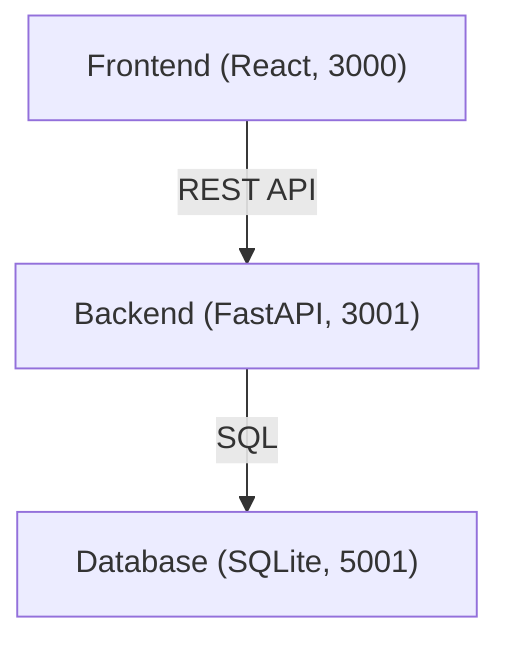

# Minimalistic Notes App

## Overview

The Minimalistic Notes App is designed for users who want the easiest, cleanest way to keep notes. With a laser focus on simplicity, the app lets you add, edit, and delete notes—each with a title and content—through a modern, clutter-free interface. All core features are streamlined to avoid distractions, letting you focus on your notes.

## Features

- **Add Notes:** Quickly create a new note with a title and content.
- **Edit Notes:** Modify titles or content anytime.
- **Delete Notes:** Remove notes effortlessly when no longer needed.
- **Minimal UI:** Clean, modern design with intuitive controls; nothing unnecessary.
- **Fast and Light:** Rapid interactions, minimal load times, and responsive interface.

## Architecture Overview

The app uses a simple, robust three-container architecture:

- **Frontend:**  
  - **Framework:** React  
  - **Runs on:** port 3000  
  - **Purpose:** Provides a clean web UI where you manage your notes.

- **Backend:**  
  - **Framework:** FastAPI  
  - **Runs on:** port 3001  
  - **Purpose:** Exposes a simple REST API for creating, reading, updating, and deleting notes.

- **Database:**  
  - **Engine:** SQLite  
  - **Runs on:** port 5001  
  - **Purpose:** Stores all note data; zero configuration needed.

### Container Overview



## How to Run Locally

This project uses a managed preview system; previews are started/stopped by the system for you.  
Each component runs on its standard development port:

| Service    | Port  | How to Preview             |
|------------|-------|---------------------------|
| Frontend   | 3000  | Preview through the system |
| Backend    | 3001  | Preview through the system |
| Database   | 5001  | Preview through the system |

**No manual setup required for environment variables.**  
When you start or stop previews, all wiring is done automatically.

### Steps

1. **Start Previews:** Use the system's preview/start mechanism to run all containers.
2. **Visit Frontend:** Open [http://localhost:3000](http://localhost:3000) in your browser to use the app.
3. (For API testing) Backend runs at [http://localhost:3001](http://localhost:3001).

## API Endpoints (Backend)

Currently, available endpoints are minimal for health checks and future note operations.  
(Expected endpoints for notes will resemble:)

| Method | Endpoint         | Description               |
|--------|------------------|--------------------------|
| GET    | `/notes`         | Fetch list of notes      |
| POST   | `/notes`         | Create a new note        |
| GET    | `/notes/{id}`    | Fetch a specific note    |
| PUT    | `/notes/{id}`    | Update an existing note  |
| DELETE | `/notes/{id}`    | Delete a note            |

**Example (fetch all):**
```http
GET http://localhost:3001/notes
```

**Example (add a note):**
```http
POST http://localhost:3001/notes
Content-Type: application/json

{
  "title": "Grocery List",
  "content": "Eggs, Milk, Bread"
}
```

*Note: The backend currently shows a health check endpoint (`/`). Full note CRUD APIs should display in `/docs` automatically as developed.*

## Database

- Type: SQLite
- Location: Managed via the preview system (no manual configuration)
- Visual tools and admin available through the `/database` container when previewed

## Environment Variables

- None are required at this time.
- All services work out-of-the-box with defaults.

## How to Test

- **Frontend:**  
  See the standard React testing instructions (`npm test`).  
  _Placeholder: Additional test scripts can be added under `notes_frontend/src/`._

- **Backend:**  
  If/when automated tests are added, describe them here.

## Folder Structure

```
project-root/
│
├── notes_frontend/       # React web UI
│   ├── src/
│   ├── package.json
│   └── ... (frontend code)
│
├── notes_backend/        # FastAPI backend
│   ├── src/
│   ├── requirements.txt
│   └── ... (backend code)
│
├── database/             # SQLite DB, scripts, info, admin
│   ├── myapp.db
│   └── ... (supporting scripts)
│
└── README.md             # (this file)
```

## Contributing

Contributions are welcome!  
You can submit suggestions, bug reports, or pull requests. Please keep code and UI minimal and clean—simplicity is the core philosophy of this project.

## License

_[To be populated: Add your license information here.]_

---

Enjoy easy, distraction-free note-taking!
